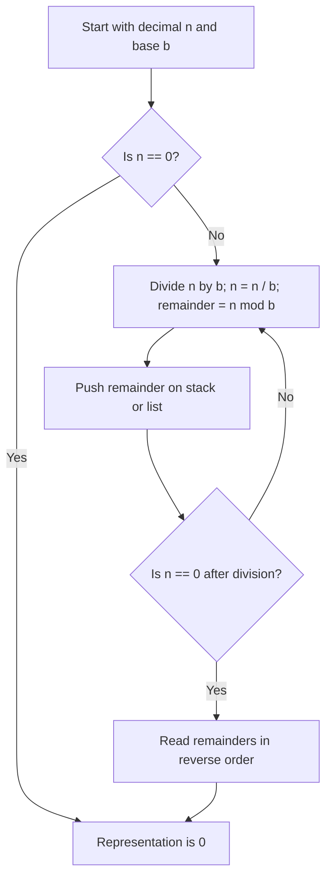
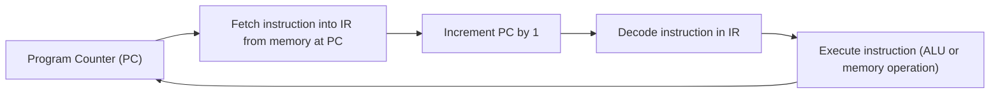

# CS-301 - Week 8 - Chapter 6: A Computing Machine (Part 1)

**Focus:** How bits become information and how a very simple computer (TOY) stores and executes programs.

This week is the bridge from "mathy formal stuff" to "real machines" by looking at:

- How integers, real numbers, and characters are represented in binary, hex, and two's complement  
- How Java’s primitive numeric types map onto those bit patterns  
- The architecture of the TOY machine and its fetch-increment-execute cycle  

---

## 1. Reading Checklist

### Required Textbook Reading

From *Computer Science: An Interdisciplinary Approach* (Sedgewick & Wayne):

- **6.1 Representing Information**  
  - Binary, decimal, and hexadecimal  
  - Converting between number systems (including the grade school algorithm to convert decimal to other bases)  
  - Two’s complement for signed integers  
  - Floating point (binary16 as a simpler version of the IEEE 754 formats used in Java float/double)  
  - Characters, ASCII, Unicode, and UTF-8  
  - Bit operations in Java and literals like `0x` and `0b`  

- **6.2 TOY Machine**  
  - Word size (16 bit words in memory and registers)  
  - Main memory, registers, program counter, and core dump  
  - Input/output via switches, buttons, and lights  
  - Instruction Set Architecture (ISA): opcodes 0-F, instruction formats, and TOY’s 16 instructions  
  - The **fetch-increment-execute** cycle (TOY’s main loop)  

Online versions (book companion site):

- 6.1 Representing Info: <https://introcs.cs.princeton.edu/java/61data/>  
- 6.2 TOY Machine: <https://introcs.cs.princeton.edu/java/62toy/>  

> **Important:** After reading each section online, scroll to the bottom and at least skim:  
> - **Exercises** (practice computation and bit-twiddling)  
> - **Web Exercises** (6.1 only; great for extra practice and bit puzzles)  
> - **Q + A** (especially helpful in 6.2 for clarifying TOY instructions and edge cases)  

Also note from the chapter hub page:  
- TOY reference card and Visual X-TOY simulator links are there and worth bookmarking.

---

## 2. Optional Video Support

These are all short and map nicely to 6.1 concepts.

**Conversions and hex arithmetic**

- Converting Binary to Hexadecimal - Tom Benyon (about 4 min)  
- Converting Hexadecimal to Binary - Tom Benyon (about 2 min)  
- Converting from Decimal to Binary - Khan Academy (about 4 min)  
- How to Add Hexadecimal Numbers - Software Nuggets (about 6 min)  

**Binary arithmetic and signed values**

- Binary: Plusses & Minuses (Why We Use Two's Complement) - Computerphile (about 16 min)  
- Binary Addition & Overflow - Computerphile (about 7 min)  

**Characters and Unicode**

- Characters, Symbols and the Unicode Miracle - Computerphile (about 10 min)  

Watch as needed to shore up weak spots, especially if base conversions or two’s complement still feel flaky.

---

## 3. Concept Flowcharts

# CS-301 - Week 8 Flowcharts

## 3.1 Converting from Decimal to Base b

This is the grade school style repeated divide and take remainders algorithm from Section 6.1.



Use this when working quiz and exercise problems for decimal to binary or hex conversions.

---

## 3.2 TOY Fetch Increment Execute Cycle

Section 6.2 defines TOY's main loop: PC -> IR -> execute -> PC.



Key point: some instructions override PC (branches and jumps) instead of just letting it keep counting up.

---

## 4. Quiz Notes / Cheat Sheet

These notes line up with the quiz questions you already answered. Skim this right before a quiz or exam.

### Q1. Largest signed integer with 10 bits

- Two’s complement range for n bits:  
  - Min: `-2^(n-1)`  
  - Max: `2^(n-1) - 1`  
- For 10 bits: max is `2^9 - 1 = 512 - 1 = 511`.  
- With 10 bits, the largest signed value is **511**.

---

### Q2. Hex BAD in decimal

- Hex digits: B = 11, A = 10, D = 13.  
- `BAD(16) = 11 * 16^2 + 10 * 16^1 + 13 * 16^0`  
- `= 11 * 256 + 10 * 16 + 13 = 2816 + 160 + 13 = 2989`.  
- So **BAD(16) = 2989**.

---

### Q3. Converting from hex to binary

- Each hex digit corresponds to exactly 4 binary bits since `16 = 2^4`.  
- Hex to binary: replace each hex digit with its 4-bit binary version.  
- Binary to hex: pad on the left with zeros so the total number of bits is a multiple of 4, then group into 4-bit chunks and convert each chunk to one hex digit.

---

### Q4. What does `mystery(int n)` do?

```java
public static String mystery (int n) {
   if (n == 0) return "";
   if (n % 2 == 0) return mystery(n/2) + '0';
   if (n % 2 == 1) return mystery(n/2) + '1';
}
```

- Recursively divides by 2, building a string of `'0'` or `'1'` based on parity.  
- This converts a decimal integer `n` to its binary representation string.  
- So it converts **decimal to binary**.

---

### Q5. Adding BAD + 86F in hex

Pattern:

1. Line up the hex digits like grade school addition.  
2. Add each column in base 16, carrying when you hit 16 or more.  

Example:

- `D + F = 13 + 15 = 28 = 1C(16)` → write C, carry 1  
- `A + 6 + carry 1 = 10 + 6 + 1 = 17 = 11(16)` → write 1, carry 1  
- `B + 8 + carry 1 = 11 + 8 + 1 = 20 = 14(16)` → write 4, carry 1  

So `BAD(16) + 86F(16) = 141C(16)`.

---

### Q6. Sign-and-magnitude vs two’s complement

Both are ways to represent signed integers using bits:

**Similarities**

- Both use the most significant bit as a sign bit.

**Differences**

- **Sign-and-magnitude**  
  - 1 bit for sign, remaining bits for magnitude.  
  - Has two representations for zero (+0 and -0).  
  - Arithmetic is more awkward for hardware.  

- **Two’s complement**  
  - Represent negative x as `2^n - x` in an n-bit word.  
  - Only one representation for zero.  
  - Addition and subtraction use the same hardware as for unsigned integers, which makes arithmetic easier.  

Quiz summary: first bit is the sign in both, but only two’s complement has a single zero and simpler arithmetic.

---

### Q7. `short`, `int`, and `long` in Java

Java defines these as two’s complement signed integers:

- `short`  -> 16-bit two’s complement  
- `int`    -> 32-bit two’s complement  
- `long`   -> 64-bit two’s complement  

So the correct framing: **16-, 32-, and 64-bit two’s complement integers**.

---

### Q8. How Java represents real numbers (floats)

The chapter models floating point with a simplified **binary16** layout:

- 1 bit sign  
- 5 bits exponent (offset binary)  
- 10 bits fraction (mantissa)  

Real Java types:

- `float`  -> 32-bit (binary32)  
- `double` -> 64-bit (binary64)  

Quiz answer idea: the example format is binary16, with sign bit, 5 exponent bits in offset binary, and 10 fraction bits.

---

### Q9. What do `0x` and `0b` mean in Java?

- `0x` prefix → hexadecimal literal (base 16)  
  - Example: `0xBAD` is hex BAD.  
- `0b` prefix → binary literal (base 2)  
  - Example: `0b101101` is 45 in decimal.  

You can use these anywhere you could use a decimal integer literal.

---

### Q10. ASCII vs UTF-8

**ASCII**

- 7-bit code for basic English letters, digits, and punctuation.  
- Often stored in an 8-bit byte with the top bit unused.

**UTF-8**

- A variable-width encoding for Unicode.  
- Uses 8 bits for ASCII characters, more bits for other characters, up to 32 bits.  
- Includes ASCII as a subset and can encode many more scripts and symbols.

Quiz takeaway: ASCII is 7-bit; UTF-8 is variable-width, backwards compatible with ASCII, and can go up to 32 bits to encode many more characters.

---

### Q11. TOY components and their roles

From 6.2 and the TOY description:

- **Memory**  
  - 256 words, each a 16-bit word at addresses 00 through FF in hex.  
  - Stores both data and instructions.  

- **Registers**  
  - 16 registers (`0` to `F`), each 16 bits.  
  - Hold intermediate values; register 0 is always 0.  

- **ALU (arithmetic logic unit)**  
  - Performs operations like add, subtract, and, xor, and shifts on register values.  

- **Instruction register (IR)**  
  - Holds the current 16-bit instruction being executed.  

- **Program counter (PC)**  
  - 8-bit register holding the address of the next instruction to execute.  

- **Pushbuttons**  
  - Let you load memory, look at memory location contents, run or step the machine, stop it, and so on.  

- **Switches**  
  - Set memory addresses and data bits, represent user input as binary 0s and 1s.  

- **Lights**  
  - Show the values of the address and data bits for memory and registers; they act as the output device.

---

### Q12. The TOY instruction cycle

Basic loop described in 6.2:

1. **Fetch**: PC selects an 8-bit memory address; contents of that word are loaded into IR.  
2. **Increment**: PC is incremented by 1 (mod 256).  
3. **Execute**: machine interprets IR as an instruction and performs its action (ALU op, load/store, branch/jump, I/O).  

This repeats until a halt instruction is executed or you manually stop the machine.

---

### Q13. Address space size: 8-bit vs 32-bit vs 64-bit

- TOY uses 8-bit memory addresses so it can access `2^8 = 256` words (00 through FF).  
- General rule: n-bit address → `2^n` addressable words.

So:

- 32-bit machine: `2^32 = 4,294,967,296` addressable words  
- 64-bit machine: `2^64 = 18,446,744,073,709,551,616` addressable words  

These are the numbers used in the quiz.

---

### Q14. Programs as data - modern examples

The TOY machine is a von Neumann machine where data and code live in the same memory; that idea is everywhere in modern systems.

Some concrete modern examples:

1. **Compilers**  
   - Take source code (a program) as input data and output machine code.  

2. **Virtual machines and interpreters**  
   - JVM, Python, Lua, and similar tools treat bytecode or scripts as data to be interpreted or JIT compiled.  

3. **IDEs and refactoring tools**  
   - Analyze program text as data in order to rename variables, extract methods, auto-format code, and so on.  

You could also include:

- Debuggers (stepping through another program’s instructions)  
- JIT compilers inside browsers or JVMs (compile code that arrives over the network)

---

## 5. Practice Ideas Tied To The Reading

You do not have to do all of these, but a handful will make the concepts stick.

From **6.1 Representing Information**:

- Exercises 1 through 3  
  - Convert decimal to binary, hex to octal, add hex numbers.  
- Web Exercises 1 through 3  
  - Excel column numbering, Elias Gamma coding, bit reversal.  
- Try implementing `bitCount`, `bitReverse`, or `Converter.toChar` and `Converter.toInt` in Java.

From **6.2 TOY Machine**:

- Exercises 1 through 3, 5, 7, 8, 10 through 12  
  - Count total bits in TOY, reason about 32-bit and 64-bit address spaces, identify no-op instructions, change PC using different opcodes.  
- Play with the Visual X-TOY simulator: load a tiny program, step through, and watch PC, registers, and memory change.

---

## 6. Repo Notes (for Future Me)

TODO

- `src/`  
  - `BinaryConverterPractice.java` - experiments with parsing, printing, and converting between bases.  
  - `ToyPlayground.java` - skeleton or notes on how TOY’s ISA might look in Java.  

- `notes/`  
  - `week8-notes.md` - your handwritten or typed notes on 6.1 and 6.2.  
  - `toy-cheatsheet.pdf` - downloaded cheatsheet from the book site.  

- `diagrams/`  
  - `decimal-to-binary-flowchart.md` (Mermaid)  
  - `toy-fetch-execute-flowchart.md`  
